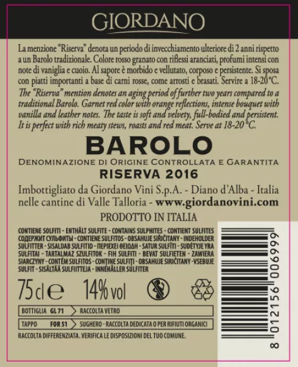

### 🍷 Named Entity Recognition for Wines

This repository contains my work on wine recognition, with the goal of identifying wine names, types, and characteristics by applying **Natural Language Processing (NLP)** techniques to wine labels.

In the Jupyter notebooks above you’ll find both theoretical explanations and code implementations of different NLP approaches I studied:

- **Image Processing**: preprocessing and OCR (Optical Character Recognition) on flat wine labels to extract text, using OpenCV and Tesseract (`pytesseract`).
- **CondRandField**: review of Maximum Entropy Models, Hidden Markov Models, and **Conditional Random Fields**, with applications to recognizing aromas, tastes, and fruit notes.
- **Bi_LSTM**: theoretical review from **Recurrent Neural Networks** to **BiLSTM**, plus an implementation in Keras/TensorFlow for recognizing aromas, tastes, and fruit notes. This notebook also includes a **BiLSTM-CRF model** (🔥 combo!).  
  Thanks to [depends-on-the-definition](https://www.depends-on-the-definition.com/introduction-named-entity-recognition-python/) for clear explanations that helped me understand package usage.
- **Clustering**: simple clustering of wine labels to explore how different aromas group together.
- **NER_Spacy**: introduction to the [spaCy](https://spacy.io/) library for **Named Entity Recognition**, with an application to extracting wine names, vineyards, production year, taste, aromas, and alcohol level.
- **OpenTag**: implementation inspired by Amazon’s OpenTag model for food labels, adapted here to wine labels.

---

### Example

Input label text from:

Extracted entities:

- **Name**: Barolo Riserva  
- **Year**: 2016  
- **Region**: Piedmont (Valle Talloria)  
- **Producer**: Giordano Vini S.p.A.  
- **Aging**: Riserva (extended aging compared to standard Barolo)  
- **Aromas/Taste**: vanilla, leather, soft, velvety, full-bodied, persistent  
- **Pairing**: meaty stews, roasts, red meat  
- **Alcohol level**: 14%  
- **Volume**: 75 cl  
